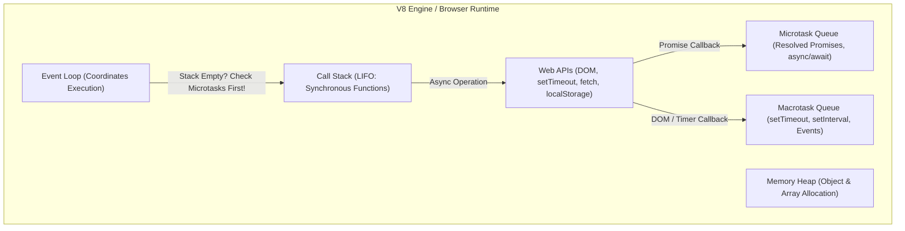
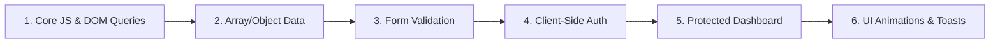

# ⚡ JavaScript Core & DOM — High Q Solid Academy

<div align="center">

# High Q Solid Academy
### *Web Development Track 04 &bull; JavaScript Core & Interactive DOM*
**"Always Ahead of Others"**

[](https://github.com/High-Q-Solid-Academy/course-javascript-core)
[](https://highqsolidacademy.com)
[](https://highqsolidacademy.com)

</div>

---

## 📖 Theoretical Foundations (Extracted from ECMAScript & Browser Standards)

### 1. The JavaScript Engine & Execution Context
JavaScript is a single-threaded, non-blocking, asynchronous concurrent runtime. When your code executes, the engine creates an **Execution Context**:
1. **Creation Phase**: Allocates memory for variables and functions (Hoisting) and sets the outer lexical environment reference.
2. **Execution Phase**: Assigns values, executes bytecode line-by-line, and manages the **Call Stack**.



### 2. The DOM Tree & Event Flow
The Document Object Model (DOM) is an object-oriented representation of the web page. Every event follows a 3-phase propagation path:
1. **Capturing Phase**: Travels from `window` down to the target node.
2. **Target Phase**: Reaches the clicked/activated element.
3. **Bubbling Phase**: Bubbles back up to `window` (enabling **Event Delegation**).

---

## 🚀 The High Q Progressive Interactivity & Auth Arc

In this course, you bring the **High Q Solid Academy Portal** to life with client-side authentication, form validation, and reactive UI:



---

## 📚 Curriculum Modules & Practical Tasks

### Module 1: Core Syntax & Pure Functions
- `let` vs `const` scope rules (Block scope vs Function scope).
- Arithmetic functions, conditional checks, and string manipulation.

### Module 2: Arrays, Objects & Data Transformation
- Deep dive into immutable transformations:
  - `map()`: Projecting student data.
  - `filter()`: Finding passing students ($\ge 50\%$).
  - `reduce()`: Calculating class averages and summary statistics.

### Module 3: Form Validation & Interactive Auth
- Listening to `submit` events and preventing default page reload (`e.preventDefault()`).
- Validating email formats and matching password confirmation fields.
- Toggling between Login and Signup tabs dynamically.

### Module 4: Client-Side Auth & Session Persistence
- Storing active user tokens in `localStorage`:
```javascript
// Simulating secure student session
localStorage.setItem('highq_auth_user', JSON.stringify({
  name: 'Adebule Quam',
  role: 'student',
  token: 'hq_jwt_simulated_token'
}));
```
- Protecting the Student Dashboard route (redirecting unauthenticated users to `/login`).

### Module 5: Asynchronous JavaScript & Fetch API
- Promises and modern `async`/`await`.
- Handling network responses with `try...catch` blocks.
- Fetching courses dynamically from an API.

### Module 6: UI Micro-Interactions & Toast Alerts
- Triggering animated notification banners upon login or grade calculation.
- Dynamic DOM counter component with state bounds.

---

## 🛠️ Automated Testing & Grading

This repository is equipped with our Vitest test suite (`tests/js.test.js`):
```bash
# Run tests locally:
npm test
```

Push your solutions to GitHub, and the automated workflow will grade your functions and verify your code!

---

<div align="center">
  <sub>© 2026 High Q Solid Academy Limited &bull; <a href="https://highqsolidacademy.com">highqsolidacademy.com</a> &bull; "Always Ahead of Others"</sub>
</div>
