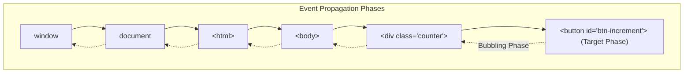

# Exercise 3: DOM Event Architecture & Reactive Counter Component

<div align="center">

### High Q Solid Academy &bull; JavaScript Core Lab 03
**"Always Ahead of Others"**

</div>

---

## 📖 Theoretical Foundations: DOM Tree Traversal & Event Propagation

*Reference: JavaScript from Beginner to Professional (javascript.pdf, Chapters 9, 10 & 11)*

### 1. The Document Object Model (DOM) Tree
The browser converts HTML markup into a living object-oriented tree of `Node` objects:
- `document.querySelector(selector)`: Uses CSS selector syntax to retrieve the first matching element node.
- `element.textContent`: Reads or sets the text content of a node and its descendants without invoking the HTML parser (much safer and faster than `innerHTML`).

### 2. Event-Driven Architecture & Event Propagation
Browser interactions are modeled as events that travel through three distinct phases:
1. **Capturing Phase**: The event descends from `window` down through ancestors to the target.
2. **Target Phase**: The event reaches the target element that initiated the interaction.
3. **Bubbling Phase**: The event bubbles upward from the target back through ancestors to `window`.



Using `addEventListener('click', handler)` allows multiple independent handlers to listen to interactions cleanly.

---

## 📋 Hands-On Lab Instructions

Inside `exercises/exercise-3-dom-counter/counter.js`:
Implement `setupCounter(containerEl)`:
1. The container element contains:
   - `#count-display`: Displays current numerical score.
   - `#btn-increment`: Increments score by 1.
   - `#btn-decrement`: Decrements score by 1 (minimum allowed value is `0`).
   - `#btn-reset`: Resets score back to `0`.
2. Encapsulate a local `count` state variable initialized to the numerical content of `#count-display` (defaulting to 0).
3. Attach click event listeners to each button to update the internal state and re-render `#count-display.textContent`.

---

## 🧪 Verification
Verify your implementation with:
```bash
npm.cmd test -- -t "Exercise 3"
```

---

<div align="center">
  <sub>High Q Solid Academy &bull; <a href="https://highqsolidacademy.com">highqsolidacademy.com</a></sub>
</div>
